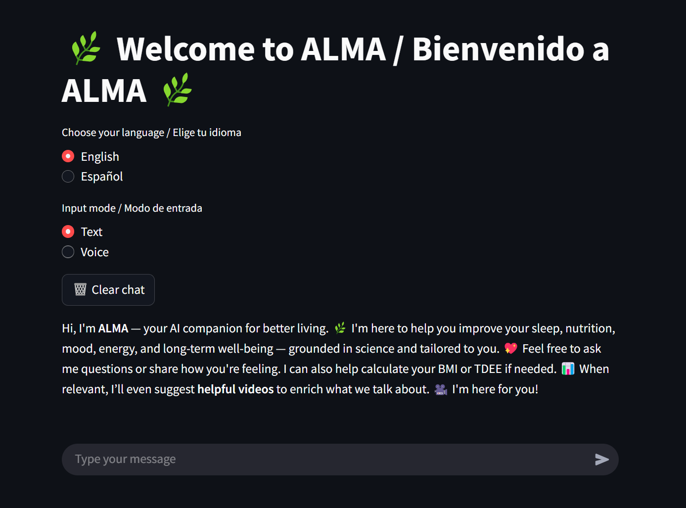

# 🧠 ALMA — Multilingual AI Chatbot for YouTube Video Q&A

> _In the U.S., private health insurance can cost over **$500/month** — and in countries like Spain, **crowded public hospitals** often lead to long waits and brief, impersonal consultations._  
>  
> Whether you're navigating complex health systems or just looking for trustworthy guidance, access to **clear, emotionally intelligent health information** has never been more critical.  
>  
> **That's where ALMA comes in.**

---

## 💡 What is ALMA?

**ALMA** is a **multimodal**, **multilingual** AI assistant designed to deliver warm, emotionally intelligent answers to health and wellness questions. It analyzes and retrieves relevant content from **YouTube videos**, allowing users to ask questions and receive precise answers — along with recommended video segments — in both **English** and **Spanish**.

---

## 🧪 Sources of Knowledge

ALMA uses health-related video content from trusted experts, including:
- **Andrew Huberman**
- **Dr. Rangan Chatterjee**
- **Dr. Vonda Wright**
- **Dr. Laurie Santos** (via **Mel Robbins Podcast**)

These sources provide diverse, research-based perspectives on physical, mental, and emotional well-being.

---

## 🌐 Features
- **Multilingual**: Supports English and Spanish
- **Multimodal Input**: Accepts both voice and text input
- **Voice Output**: Speaks responses using Microsoft Edge TTS
- **Video Integration**: Suggests helpful YouTube clips based on similarity
- **Health Tools**: Built-in BMI, TDEE, and Macronutrient calculators
- **Short-Term Memory**: Remembers last 3 user exchanges for natural flow
- **Powered by GPT-4** and OpenAI embeddings
- **Retrieval-Augmented Generation (RAG)** pipeline with Pinecone
- **Fully integrated with LangChain and LangSmith for evaluation and tracing**

---

## 🔄 How It Works

### Data Pipeline
1. **Extract YouTube Transcripts** using `youtube_transcript_api`
2. **Chunk and Tag** transcript content for semantic retrieval
3. **Manually Curate Video Segments** with metadata and timestamps
4. **Embed** all data using OpenAI embeddings
5. **Store in Pinecone** vector databases: `alma-index` (transcripts) & `alma-video-index` (segments)

### Conversational Agent (LangChain)
- Uses a **Zero-Shot ReAct Agent**
- Retrieves context from vector DB
- Builds prompt with short-term memory (last 3 turns)
- Applies emotionally aware prompt templates (EN/ES)
- GPT-4 generates final response

### Tools
- `alma_calculator` tool handles BMI, TDEE, and macro calculations
- Agent chooses whether to use tool or GPT-4 directly
- Responses are wrapped in ALMA’s caring tone

---

## 🎤 Voice Interaction
- **Input**: Google Speech Recognition via `speech_recognition`
- **Output**: Edge TTS with natural voice
- Option to choose between text or voice at runtime

---

## 🔍 Evaluation with LangSmith
- Tracks all runs and responses
- Logs:
  - Input question
  - Tool selection
  - Retrieved documents
  - GPT-4 prompt & final output
- Helps trace bugs, misfires, and optimize prompt performance

---

## 🌟 Technologies Used
- Python
- LangChain
- OpenAI GPT-4
- Pinecone
- Streamlit / CLI Interface
- Edge TTS
- Google STT
- LangSmith

---

## 💼 Setup & Running Locally (with voice input)

 Clone this repo:
   
> git clone https://github.com/your-username/alma-chatbot.git
cd alma-chatbot

> pip install -r requirements.txt
   
Add a .env file:
   
> OPENAI_API_KEY=your-key
>
> PINECONE_API_KEY=your-key
> 
> FFMPEG_PATH=/your/path/to/ffmpeg

 Run the app:
> streamlit run ALMA_app.py

---

## 🌐 Run Publicly (Text-Only Version)

You can try the public version here:

👉 https://almachatbot-dbeduj6pzce3n5j2r8ejrc.streamlit.app

This version supports text input only, due to browser and platform limitations on audio recording in Streamlit Cloud.
